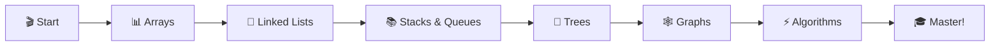

# 🚀 DSA-in-practicals

<div align="center">

### 💡 Master Data Structures & Algorithms Through Practice 💡


*A comprehensive journey through the world of Data Structures and Algorithms using C programming* 🎯

[⭐ Star](https://github.com/sanskarvibhute?tab=stars) • [🐛 Report Bug](https://github.com/sanskarvibhute/DSA-in-practicles-/issues) • [💡 Request Feature](https://github.com/sanskarvibhute/DSA-in-practicles-/issues)

</div>

---

## 🌟 Why This Repository?

🎓 **Learn by Doing** - Every concept comes with practical, runnable code  
📖 **Crystal Clear** - Detailed comments and explanations in every file  
🔥 **Production Ready** - Clean, optimized implementations  
💪 **Interview Prep** - Cover all essential DSA topics for coding interviews  
🎯 **Beginner Friendly** - Start from basics and progress to advanced topics  

---

## 📚 What's Inside?

### 🏗️ **Data Structures**

<table>
<tr>
<td width="50%">

#### 📦 Linear Structures
- 🔢 **Arrays** - Foundation of all data structures
- 🔗 **Linked Lists** - Singly, Doubly & Circular
- 📚 **Stacks** - LIFO principle in action
- 🎫 **Queues** - FIFO, Circular & Priority

</td>
<td width="50%">

#### 🌳 Non-Linear Structures
- 🌲 **Trees** - Binary, BST & AVL Trees
- 🕸️ **Graphs** - Directed & Undirected
- #️⃣ **Hash Tables** - Fast lookups
- ⛰️ **Heaps** - Min & Max Heaps

</td>
</tr>
</table>

### ⚡ **Algorithms**

<table>
<tr>
<td width="33%">

#### 🔍 **Searching**
- 👀 Linear Search
- 🎯 Binary Search
- 🔎 Jump Search
- 📊 Interpolation

</td>
<td width="33%">

#### 🔄 **Sorting**
- 💧 Bubble Sort
- 🎨 Selection Sort
- 📥 Insertion Sort
- ⚡ Quick Sort
- 🔀 Merge Sort
- 🏔️ Heap Sort

</td>
<td width="33%">

#### 🧠 **Advanced**
- 🌊 BFS & DFS
- 🛣️ Dijkstra's
- 🌿 Kruskal's
- 💎 Dynamic Programming
- 🎁 Greedy Algorithms
- 🔄 Backtracking

</td>
</tr>
</table>

---

## 🚀 Quick Start Guide

### 📋 Prerequisites

```bash
✅ GCC Compiler (or any C compiler)
✅ Basic C Programming Knowledge
✅ Passion for Learning! 🔥
```

### ⚙️ Installation

```bash
# 1️⃣ Clone this awesome repository
git clone https://github.com/sanskarvibhute/DSA-in-practicals.git

# 2️⃣ Navigate to the project
cd DSA-in-practicals

# 3️⃣ Choose any topic and compile
gcc arrays/array_operations.c -o array_ops

# 4️⃣ Run and learn!
./array_ops
```

---

## 💻 Code Example

```c
/* 🎯 Stack Implementation Example */
#include <stdio.h>
#include "stack.h"

int main() {
    Stack myStack;
    initialize(&myStack);
    
    // 📥 Push elements
    push(&myStack, 10);
    push(&myStack, 20);
    push(&myStack, 30);
    
    printf("🔝 Top element: %d\n", peek(&myStack));
    printf("📤 Popped: %d\n", pop(&myStack));
    
    return 0;
}
```

**Output:**
```
🔝 Top element: 30
📤 Popped: 30
```

---

## 📂 Project Structure

```
📦 DSA-in-practicals
┣ 📂 arrays
┃ ┣ 📄 basic_operations.c
┃ ┣ 📄 searching.c
┃ ┗ 📄 sorting.c
┣ 📂 linked-lists
┃ ┣ 📄 singly_linked_list.c
┃ ┣ 📄 doubly_linked_list.c
┃ ┗ 📄 circular_linked_list.c
┣ 📂 stacks
┃ ┣ 📄 array_stack.c
┃ ┗ 📄 linked_stack.c
┣ 📂 queues
┣ 📂 trees
┣ 📂 graphs
┣ 📂 sorting-algorithms
┣ 📂 searching-algorithms
┣ 📂 dynamic-programming
┗ 📄 README.md
```

---

## 🎯 Learning Path



**Recommended Order:**
1. 🔢 Arrays & Basic Operations
2. 🔗 Linked Lists (Singly → Doubly → Circular)
3. 📚 Stacks & 🎫 Queues
4. 🔍 Searching Algorithms
5. 🔄 Sorting Algorithms
6. 🌳 Trees (Binary → BST → AVL)
7. 🕸️ Graphs & Graph Algorithms
8. 💎 Dynamic Programming

---

## 🤝 Contributing

We ❤️ contributions! Here's how you can help:

1. 🍴 Fork the repository
2. 🌿 Create your branch (`git checkout -b feature/AmazingFeature`)
3. ✍️ Commit changes (`git commit -m '✨ Add some AmazingFeature'`)
4. 📤 Push to branch (`git push origin feature/AmazingFeature`)
5. 🎉 Open a Pull Request

### 📝 Contribution Guidelines

✅ Write clean, readable code  
✅ Add meaningful comments  
✅ Include complexity analysis  
✅ Test thoroughly  
✅ Follow C standards  
✅ Update documentation  

---

## 📚 Resources & References

| Resource | Link | Description |
|----------|------|-------------|
| 📖 **CLRS** | [MIT Press](https://mitpress.mit.edu/books/introduction-algorithms) | The Bible of Algorithms |
| 🌐 **GeeksforGeeks** | [Visit](https://www.geeksforgeeks.org/data-structures/) | Comprehensive DSA Tutorials |
| 📝 **C Docs** | [DevDocs](https://devdocs.io/c/) | C Programming Reference |
| 🎥 **YouTube** | Various | Video Tutorials |

---

## 💪 Complexity Cheat Sheet

| Data Structure | Access | Search | Insert | Delete |
|----------------|--------|--------|--------|--------|
| Array | O(1) | O(n) | O(n) | O(n) |
| Linked List | O(n) | O(n) | O(1) | O(1) |
| Stack | O(n) | O(n) | O(1) | O(1) |
| Queue | O(n) | O(n) | O(1) | O(1) |
| Binary Search Tree | O(log n) | O(log n) | O(log n) | O(log n) |
| Hash Table | N/A | O(1) | O(1) | O(1) |

---

## 🎖️ Achievements

⭐ **100+ Implementations**  
🔥 **Production-Quality Code**  
📖 **Comprehensive Documentation**  
🎯 **Interview Ready**  

---

## 📬 Connect & Support

<div align="center">

### 💬 Questions? Suggestions?

📧 [Open an Issue](https://github.com/sanskarvibhute/DSA-in-practicles-/issues) • 💭 [Start a Discussion](https://github.com/sanskarvibhute/DSA-in-practicals/discussions)

### ⭐ Show Your Support

If this repository helped you, please give it a star! ⭐  
*It motivates us to create more amazing content!* 🚀

[](https://github.com/sanskarvibhute?tab=stars)
[](https://github.com/sanskarvibhute?tab=followers)

</div>

---

## 📄 License

This project is licensed under the MIT License - see the [LICENSE](LICENSE) file for details.

---

<div align="center">

### 🌟 Made with ❤️ and C Programming 🌟

**"The only way to learn a new programming language is by writing programs in it." - Dennis Ritchie**

🔥 **Happy Coding!** 🔥

[⬆ Back to Top](#-dsa-in-practicals)

</div>

